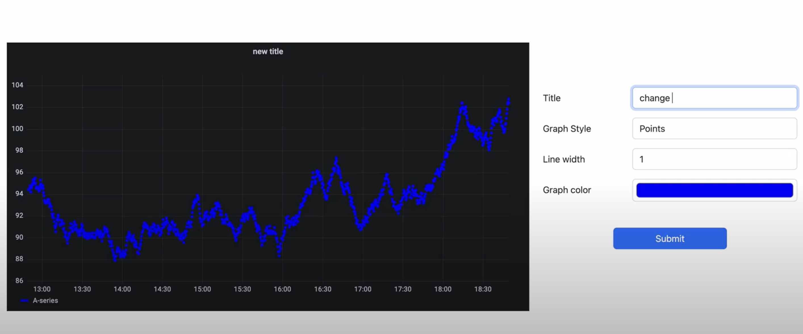

# About Grafana
Grafana is an open source solution for running data analytics, pulling up metrics that make sense of the massive amount of data & to monitor our apps with the help of cool customizable dashboards.

## About the app
This app gives demonstrates how we can embed a grafana panel into our node app and display it on our webpage as well as edit the properties of the grafana chart. This app is built using NodeJS, ExpressJS and EJS templating engine.

### UI Preview

## Project Setup
- Clone the github repo
- Run `npm i` and it will install all the project dependencies

#### Installing Grafana and getting API Keys
- Go to [Grafana Installation Guide](https://grafana.com/docs/grafana/latest/installation/) and install grafana.
- After completing the installation, you should be able to open grafana by going to `http:\\localhost:3000` from your browser.
- From the sidemenu, select `Configuration` -> `API Key` and generate a new API key with `Admin` role. Paste this key inside your `env` file

#### Creating a dashboard and panel
- Select the `Create` option from sidemenu and select `Dashboard`, now select `Add a new panel`. You'll see grafana creates a panel for you with some dummy data. We're going to embed this panel in our node app
- Click on the `Save` button from the menu bar and enter a name for your dashboard and save it.
- Click on the panel title -> `Share` -> `Embed` -> Copy the value of src attribute from the  `iframe` element and paste it in the `env` file

#### Changing Grafana configuration
- Now, to give permission to access grafana dashboard from our node server, we need to change some configurations. Checkout [Grafana Configuration Guide](https://grafana.com/docs/grafana/latest/administration/configuration/) to locate the `grafana.ini` config file in your OS and open it using any text editor.
- Search for `allow_embedding` key and change its value to `true`. Also remove the semicolon `;` before the key name to uncomment it - This property allows us to embed our panel into other webpages.
- Now, search for `anonymous` keyword and inside `auth.anonymous` section, remove the semicolon before property name and set the `enabled` property to `true`. This now allows us to access the panel without need to login to grafana.
- You can confirm these changes by going to `http://localhost:3000/admin/settings` and checking the property values

#### Running the app

- Run `npm run dev` to start the node server and go to `http:\\localhost:4000` to see the embedded panel
- You can also change the panel properties by going to `\edit` route

### Contact information
Please feel free to reach out to me at `yashsolanki1709@gmail.com` in case you have any queries.